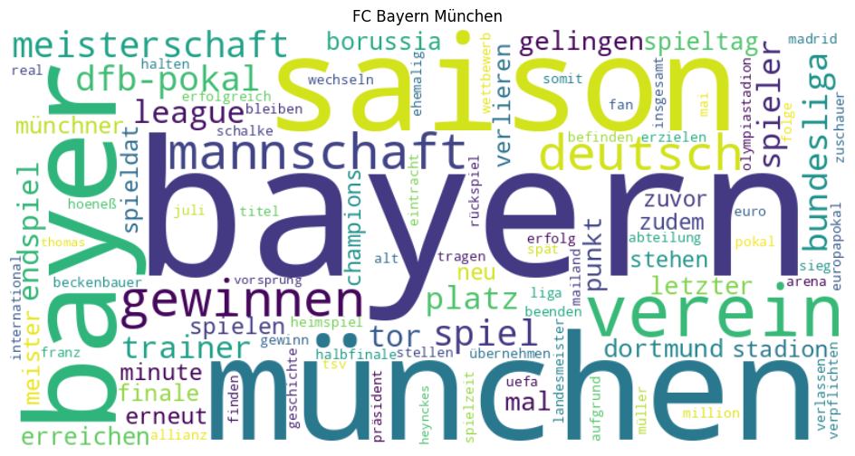

# GenSoccerAnalyzer

GenSoccerAnalyzer ist eine Streamlit-App zur Analyse von Fussballdaten mit mehreren Quellen und Agenten.

- OpenLigaDB: Tabellen und Team-KPIs
- StatsBomb: Event-basierte Kennzahlen (z. B. xG)
- Wikipedia: Wortwolken und Sentiment
- Multi-Agent-Orchestrierung mit LangGraph

## Wortwolke (Bild-Platzhalter)

Lege dein Bild z. B. unter diesem Pfad ab:

- docs/images/wortwolke.png

Dann bleibt dieser Platzhalter sofort nutzbar:



Hinweis: Solange die Datei noch nicht existiert, zeigt GitHub nur den Alt-Text an.

## Projektstruktur (Auszug)

- frontend/: Streamlit-Tabs und UI-Helfer
- services/: Datenlogik, Repository und KPI-Services
- agents/: Orchestrierung und Agenten
- data/: Daten, Exporte und Ingestion-Skripte
- Grundlagen/: Notebooks und vorbereitende Skripte

## Voraussetzungen

- Python 3.12+
- Virtuelle Umgebung empfohlen

## Installation

### Option A: mit pip

1. Virtuelle Umgebung erstellen und aktivieren
2. Abhängigkeiten installieren:

```bash
pip install -r requirements.txt
```

### Option B: mit uv

```bash
uv add -r requirements.txt
```

## App starten

Aus dem Projektroot:

```bash
uv run streamlit run frontend/design.py
```

## LangGraph-Konfiguration

Die Graph-Definition liegt in langgraph.json:

- Graph-Name: soccer_analyzer
- Einstieg: agents.orchestrator:app

## Hinweise

- Falls Sentiment-Daten fehlen, prüfe, ob die Datei data/wikipedia_articles.json vorhanden ist.
- Falls Wortwolken fehlen, pruefe, ob data/haeufigkeiten_wortwolken.json vorhanden ist.
- Bei frischer Umgebung kann NLTK beim ersten Start Ressourcen nachladen.

## Deployment-Hinweis zu soccer.db

Die Datei data/soccer.db kann für GitHub schnell zu groß werden.
Für große Binärdateien ist ein Direkt-Upload ins Repository ungeeignet.

Empfehlung für produktiven Betrieb:

- Lokal: soccer.db für Entwicklung und Tests behalten.
- Cloud: Datenbank auf einem Cloud-Server oder Managed-DB-Dienst bereitstellen.
- App: Im Deployment auf diese zentrale Datenquelle zugreifen, damit der Chat nicht nur lokal stabil funktioniert.

Warum das wichtig ist:

- Reproduzierbare Datenbasis für alle Nutzer statt nur auf deinem Rechner.
- Bessere Performance und Verfügbarkeit im Live-Betrieb.
- Keine Probleme mit großen DB-Dateien im Git-Repository.
